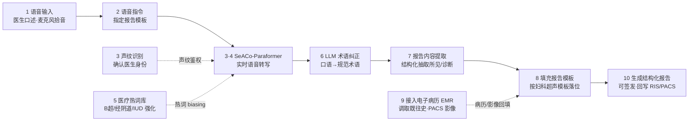

# AI 超声语音助手 · 系统技术流程说明

> 红房子医院（复旦大学附属妇产科医院）AI 超声助手项目
> 核心：以 **SeACo-Paraformer** 实时语音识别为引擎，声纹 / 医疗热词 / 电子病历为旁支，全程院内内网闭环，实现"医生口述 → 结构化超声报告"。

---

## 一、总体链路（10 步主流程）

---

## 二、按泳道分层

| 泳道 | 角色 | 包含节点 |
|---|---|---|
| **01 医生 · 超声工作站（前端 UI）** | 医生操作与结果呈现 | 语音输入、语音指令指定模板 |
| **02 语音识别引擎 ASR（FunASR Runtime）** | 院内内网部署的识别服务 | 声纹识别、SeACo-Paraformer、医疗热词库 |
| **03 智能后处理（LLM）** | 文本规范化与结构化 | LLM 术语纠正、报告内容提取 |
| **04 报告生成 · EMR/PACS 集成** | 数据回填与产出 | 接入 EMR、填充模板、生成结构化报告 |

---

## 三、分阶段说明

### ① 采集与指令
1. **语音输入**：医生对着工作站麦克风口述检查所见与诊断。
2. **语音指令 · 指定报告模板**：医生用自然语言切换模板，例如"插入妇科常规模板"，系统据此加载对应报告骨架。

### ② 实时语音识别（SeACo-Paraformer）
3. **声纹识别**：在识别前先确认说话医生身份，绑定书写权限。
3·4. **SeACo-Paraformer 实时转写**：非自回归（NAT）模型一次前向出整句，低延迟、流式输出，把口述音频实时转成文字。
5. **配套医疗热词**：注入"B超 / 经阴道 / IUD / 宫腔 / 血流"等专有词列表，通过热词 biasing 提升医疗术语识别率。

### ③ 纠错与内容提取
6. **LLM 术语纠正**：大模型把口语化表达、同音误识纠正为规范医学术语。
7. **报告内容提取**：从规范文本中结构化抽取"超声所见 / 超声提示 / 诊断"等字段。

### ④ 模板填充与结构化报告
8. **填充报告模板**：把结构化字段按妇科超声模板自动落位。
9. **接入电子病历 EMR**：调取患者既往史、PACS 影像等上下文回填。
10. **生成结构化报告**：形成可直接签发的结构化报告，并回写 RIS / PACS。

---

## 四、节点间数据流

| 传递 | 内容 |
|---|---|
| 语音输入 → 指定模板 | 口述音频流 |
| 指定模板 → SeACo-Paraformer | PCM 音频流 |
| 声纹识别 → ASR | 声纹鉴权（旁支） |
| 医疗热词库 → ASR | 热词 biasing（旁支） |
| ASR → LLM 纠错 | 实时转写文本 |
| LLM 纠错 → 内容提取 | 规范文本 |
| EMR → 填充模板 | 病历 / 影像回填（旁支） |
| 内容提取 → 填充模板 | 结构化字段 |
| 填充模板 → 结构化报告 | 最终报告 |

---

## 五、如何嵌入现有超声工作站

- **服务化部署**：FunASR Runtime 以 **HTTP/gRPC 服务**部署在院内内网，音频与文本不出公网，满足医疗数据合规。
- **工作站集成**：工作站麦克风采集音频 → 实时推送 ASR 服务 → 转写文本**实时回写 UI 文本框**，医生边说边看。
- **后处理在院内**：LLM 纠错与模板填充在本地 / 院内推理完成，医生核对后**一键引用、签发**。
- **闭环回写**：最终报告写回 RIS / PACS，与现有检查队列、报告工作站打通。

---

## 六、SeACo-Paraformer 技术要点

- **SeACo**：Semantic-Enhancement and Contrast optimization，语义增强 + 对比优化，提升中文口语识别。
- **Paraformer**：非自回归（Non-Autoregressive）建模，一次前向输出整句，相比流式自回归方案延迟更低。
- **配套组件**：`fsmn-vad` 做语音端点检测（断句），`CT-Transformer` 做标点恢复。
- **热词增强**：通过医疗热词列表注入，强化"经阴道 / 宫腔 / IUD / 血流"等专科术语的召回。
- **模型来源**：`iic/speech_seaco_paraformer_large_asr_nat-zh-cn-16k-common-vocab8404-pytorch`（FunASR / ModelScope，Apache-2.0）。
